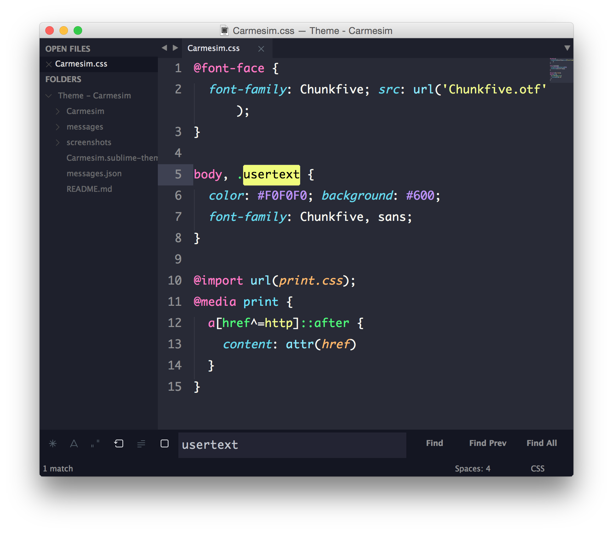

# Carmesim

A set of custom UI themes for Sublime Text 2/3 based on [Spacegray](https://github.com/kkga/spacegray). Comes with [Dracula](https://github.com/zenorocha/dracula-theme) color scheme.

*All the credits to the creators of themes Dracula and Spacegray!*

***

### Theme

#### Carmesim



*The font used in the screenshots is Monaco.*

***

### Installing and Activating

- Install Dracula color scheme
- Install Carmesim theme
- Edit User Settings with the following:

```json
{
  "color_scheme": "Packages/Dracula Color Scheme/Dracula.tmTheme",
  "theme": "Carmesim.sublime-theme"
}
```

***Note: Don't forget to restart Sublime Text after activating the theme.***

***

### Thanks

All the credits to the creators os theme Dracula and Spacegray!

The Spacegray is contributed by [kkga](https://github.com/kkga/spacegray).

The Dracula is contributed by [Zeno Rocha](https://github.com/zenorocha/dracula-theme).
